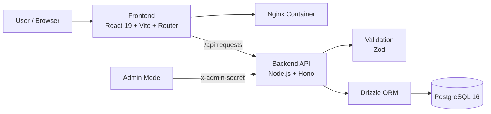

<div align="center">

# MyTech

### Full-stack portfolio platform built like a production product

<p>
  Не статичная страница-резюме, а полноценная система с frontend, backend API,
  PostgreSQL, admin-режимом, Docker-инфраструктурой и Vercel-ready deployment setup.
</p>

[](https://www.typescriptlang.org/)
[](https://react.dev/)
[](https://vitejs.dev/)
[](https://tailwindcss.com/)
[](https://nodejs.org/)
[](https://hono.dev/)
[](https://www.postgresql.org/)
[](https://www.docker.com/)

</div>

---

## TL;DR

**MyTech** показывает портфолио не как набор красивых блоков, а как настоящий digital product.

Внутри проекта есть:

- React SPA с отдельными страницами и цельным визуальным языком
- backend API на Hono с валидацией и admin-защитой
- PostgreSQL для контента, проектов и контактных сообщений
- admin flow для редактирования About и управления проектами
- Docker Compose для локального полного запуска
- подготовка к раздельному deployment на Vercel

Если коротко: это проект, который демонстрирует не только UI, но и зрелый full-stack подход.

---

## Why This Project Exists

Большинство portfolio-сайтов хорошо выглядят, но почти ничего не говорят о качестве инженерии. **MyTech** построен как ответ на эту проблему.

Это проект, который одновременно:

- показывает опыт, стек и мышление разработчика в форме реального продукта
- демонстрирует full-stack подход, а не только умение собирать интерфейсы
- выступает как production-minded showcase с backend, базой данных и deployment-ready структурой
- остаётся расширяемой платформой, а не одноразовой витриной

Для работодателя это сигнал: автор умеет не только сделать красивую страницу, но и спроектировать систему целиком.

---

## What You See As A Visitor

### Public user flow

- **Home**: личное позиционирование, краткий стек, быстрый вход в ключевые разделы
- **Projects**: список проектов с фильтрацией внимания через карточки и теги технологий
- **Project Detail**: подробный разбор проекта, features, стек, GitHub/demo ссылки
- **About**: биография, tech stack, focus areas, competencies, образовательные репозитории
- **Work Terms**: как автор работает, что берёт в работу и как строит взаимодействие
- **Contact**: форма связи, которая реально отправляет данные в backend и сохраняет их в БД

### Admin flow

- редактирование блока “Обо мне” через модальное admin UI
- управление проектами через create / update / delete сценарии
- добавление GitHub URL для about-проектов прямо из формы
- защита мутаций через `x-admin-secret`

---

## Product Summary

**MyTech** — персональная full-stack платформа Радмира Абраева, где контент, проекты и коммуникация собраны в единую систему.

Внутри проекта есть:

- React SPA с несколькими страницами и единым визуальным языком
- REST API на Hono с валидацией и admin-защитой
- PostgreSQL как реальное хранилище данных
- admin flow для управления контентом About и проектами
- Docker Compose setup для локального запуска всего стека
- Vercel-ready структура для раздельного деплоя frontend и backend

---

## What Makes It Strong

- **Real full-stack scope.** Здесь есть frontend, backend, БД, middleware, CRUD, инфраструктура и deployment concerns.
- **Product mindset.** Это цельный пользовательский и редакторский сценарий, а не набор декоративных секций.
- **Clean engineering surface.** API-слой, hooks, layout, pages, sections и data boundaries разнесены предсказуемо.
- **Operational readiness.** Проект запускается локально целиком, а не по частям и не только в теории.
- **Consistent UI system.** Палитра, панели, кнопки, spacing и tech badges подчинены одной визуальной системе.
- **Good extension potential.** Поверх текущего каркаса можно безболезненно наращивать сущности, аналитику, auth и CMS-поведение.

---

## Key Capabilities

### Пользовательская часть

- landing / hero screen с личным positioning и быстрой навигацией
- About page с биографией, tech stack, focus areas, competencies и education repos
- projects catalogue с карточками и отдельными detail pages
- work terms page с форматом сотрудничества
- contact page с реальной формой отправки сообщений

### Админский режим

- редактирование контента блока “Обо мне” без правки исходников
- структурное редактирование проектов внутри About, включая GitHub URL
- создание, обновление и удаление карточек проектов
- защита админских операций через `x-admin-secret`

### Инженерная часть

- единый API-клиент на фронтенде
- строгая типизация frontend и backend слоёв
- контейнеризация всего стека через Docker Compose
- подготовка к Vercel для фронтенда и backend serverless entrypoint

---

## Architecture At A Glance



### Layer responsibilities

- **Frontend** рендерит страницы, формы, transitions, admin modal flow и API-вызовы
- **API client** инкапсулирует запросы и типы данных в одном месте
- **Backend** валидирует payload'ы, отдаёт данные и обрабатывает CRUD-операции
- **Database** хранит projects, about content и contact submissions

---

## Project Structure

```text
MyTech/
├── frontend/
│   ├── src/
│   │   ├── components/
│   │   │   ├── admin/        # admin-модалки и формы
│   │   │   ├── layout/       # Navbar, Footer, ScrollToTop
│   │   │   ├── sections/     # Hero, About, Projects, Contact, Services
│   │   │   └── ui/           # ProjectCard, SkillBadge, ServiceCard и др.
│   │   ├── context/          # admin-state
│   │   ├── data/             # статические данные и цветовые карты
│   │   ├── hooks/            # useProjects, useInView, useScrollProgress и др.
│   │   ├── pages/            # route-level страницы
│   │   ├── api.ts            # общий API client + shared types
│   │   └── index.css         # глобальные токены и визуальная система
│   ├── Dockerfile
│   ├── nginx.conf
│   └── vercel.json
│
├── backend/
│   ├── api/                  # Vercel handler
│   ├── drizzle/              # SQL migrations
│   ├── src/
│   │   ├── db/               # client, schema, migrate
│   │   ├── middleware/       # adminAuth
│   │   ├── routes/           # about, contact, projects
│   │   ├── app.ts            # shared Hono app
│   │   └── index.ts          # Node server entrypoint
│   ├── Dockerfile
│   └── drizzle.config.ts
│
├── compose.yml
└── README.md
```

---

## Feature Map

| Domain | What it does | Why it matters |
|---|---|---|
| **Portfolio presentation** | Показывает личный бренд, стек, проекты и подход к работе | Формирует сильное первое впечатление |
| **Projects module** | Хранит проекты как реальные сущности, а не как жёстко вшитые блоки | Демонстрирует data-driven UI |
| **About content management** | Даёт редактировать контент без ручной правки кода | Показывает product thinking и maintainability |
| **Contact pipeline** | Отправляет и сохраняет сообщения через backend | Доказывает, что система работает с реальными данными |
| **Admin protection** | Ограничивает мутации через secret header | Добавляет базовую operational safety |
| **Deployment setup** | Позволяет запускать стек локально и готовит проект к Vercel | Показывает зрелость beyond development |

---

## Технологии

### Frontend Stack

- **React 19** — современный UI-слой и компонентная архитектура
- **React Router 7** — маршрутизация по страницам
- **TypeScript** — строгая типизация без размытых контрактов
- **Vite 6** — быстрая разработка и production build
- **Tailwind CSS 4** — утилитарная стилизация и кастомные design tokens
- **Lucide React** — иконки интерфейса

### Backend Stack

- **Node.js 20** — runtime для локального запуска, Docker и Vercel
- **Hono** — лёгкий и быстрый HTTP-framework
- **Zod** — валидация входящих данных
- **Drizzle ORM** — typed schema и работа с PostgreSQL
- **postgres** — драйвер для подключения к БД
- **dotenv** — конфигурация окружения

### Infrastructure

- **PostgreSQL 16** — основное хранилище данных
- **Docker + Docker Compose** — локальный orchestration всего стека
- **Nginx** — отдача frontend-сборки
- **Vercel-ready setup** — отдельные точки входа для frontend и backend

---

## Why The Stack Choice Makes Sense

- **React + Vite** дают быстрый DX и чистую SPA-модель без лишнего фреймворк-оверкилла
- **Hono** хорошо подходит для компактного typed API без тяжёлой серверной рамки
- **Drizzle + PostgreSQL** позволяют держать данные и схему под контролем без магии
- **Docker Compose** делает локальный запуск воспроизводимым
- **Vercel split deployment** хорошо подходит для разделения frontend и backend по ролям

---

## Engineering Highlights

- API и frontend используют общие, понятные контракты данных
- проект не завязан на моках: формы и контент реально ходят в backend
- есть отдельный middleware для admin-защиты
- backend умеет работать с legacy-данными и нормализует About payload
- frontend использует единый цветовой словарь технологий, а не хаотичный набор классов
- роутинг доведён до UX-деталей, включая возврат наверх при переходах

### Additional engineering details

- SPA routing корректно работает через Nginx rewrites и Vercel rewrites
- project detail pages и projects grid используют единый typed project model
- admin UI уже вынесен в отдельные modal-компоненты, а не зашит прямо в страницы
- контент About нормализуется на backend, включая совместимость со старыми структурами данных

---

## Local Development

### Через Docker

```bash
git clone https://github.com/rxritet/MyTech.git
cd MyTech
cp .env.example .env
docker compose up -d --build
```

После запуска:

- frontend: `http://localhost:5173`
- backend: `http://localhost:3000`
- database: `localhost:5432`

### Что поднимется

- `mytech_frontend`
- `mytech_backend`
- `mytech_db`

---

## Development Commands

### Frontend

```bash
cd frontend
npm run dev
npm run build
npm run typecheck
```

### Backend

```bash
cd backend
npm run dev
npm run migrate
npm run typecheck
```

---

## Environment Variables

### Корень проекта

| Переменная | Назначение | Пример |
|---|---|---|
| `POSTGRES_USER` | пользователь PostgreSQL | `mytech_user` |
| `POSTGRES_PASSWORD` | пароль PostgreSQL | `your_password_here` |
| `POSTGRES_DB` | имя базы данных | `mytech_db` |
| `DATABASE_URL` | строка подключения для backend | `postgres://mytech_user:password@db:5432/mytech_db` |
| `ADMIN_SECRET` | секрет для защищённых admin-запросов | `change_me` |

### Frontend

| Переменная | Назначение | Пример |
|---|---|---|
| `VITE_API_URL` | адрес backend API | `http://localhost:3000` |

---

## API Overview

Base URL локально: `http://localhost:3000`

### Contacts

- `POST /api/contacts` — отправить сообщение из формы
- `GET /api/contacts` — получить список сообщений

### About

- `GET /api/about` — получить контент страницы “Обо мне”
- `PATCH /api/about` — обновить контент About через admin-secret

### Projects

- `GET /api/projects` — получить список проектов
- `GET /api/projects/:slug` — получить один проект
- `POST /api/projects` — создать проект
- `PUT /api/projects/:id` — обновить проект
- `DELETE /api/projects/:id` — удалить проект

---

## Deployment Story

Проект специально подготовлен так, чтобы его можно было запускать в двух режимах:

### 1. Local full-stack mode

- весь стек живёт в Docker Compose
- frontend, backend и PostgreSQL запускаются как отдельные сервисы
- сценарий подходит для разработки, отладки и демонстрации

### 2. Split cloud deployment

- frontend деплоится отдельно как Vercel SPA
- backend деплоится отдельно как Vercel serverless API
- database остаётся внешней PostgreSQL-инстанцией

Это даёт проекту хороший баланс между локальной воспроизводимостью и облачной простотой.

---

## Deployment

Проект подготовлен к раздельному деплою frontend и backend.

### Frontend

- деплоится как отдельный Vercel project с root directory `frontend`
- использует `vercel.json` для SPA rewrites
- получает `VITE_API_URL` через environment variables

### Backend

- деплоится как отдельный Vercel project с root directory `backend`
- использует serverless handler в `backend/api/[[...route]].ts`
- требует `DATABASE_URL` и `ADMIN_SECRET`

---

## What This Repository Demonstrates

Если смотреть на MyTech как на engineering showcase, этот репозиторий демонстрирует:

- умение проектировать систему целиком, а не только отдельные экраны
- понимание data flow между UI, API и базой данных
- аккуратный подход к типам, формам, admin-инструментам и UI consistency
- способность доводить проект до deployable состояния

Это особенно важно для full-stack и backend-oriented позиции: репозиторий показывает не “как выглядит”, а “как спроектировано”.

---

## Why It Works Well As A Portfolio

MyTech особенно хорошо показывает себя в двух сценариях:

- **для работодателя** — как доказательство full-stack подхода, не только UI-навыков
- **для заказчика** — как пример аккуратного продукта с ясной архитектурой и продуманной подачей

Именно поэтому проект считывается не как “ещё один сайт о себе”, а как демонстрация зрелости: от интерфейса до инфраструктуры.

---

## Possible Next Evolutions

Если развивать проект дальше, логичными следующими шагами будут:

- полноценная аутентификация вместо одного admin secret
- dashboard для просмотра контактных сообщений
- фильтрация и сортировка проектов на frontend
- upload flow для изображений и assets
- тестирование ключевых API и UI сценариев
- analytics / monitoring layer для production deployment

---

## Автор

**Радмир Абраев**

- Backend / Full-stack Developer
- Software Engineering student at AlmaU
- GitHub: `rxritet`

---

<div align="center">
    <sub>MyTech shows not only what was built, but how thoughtfully it was built.</sub>
</div>
